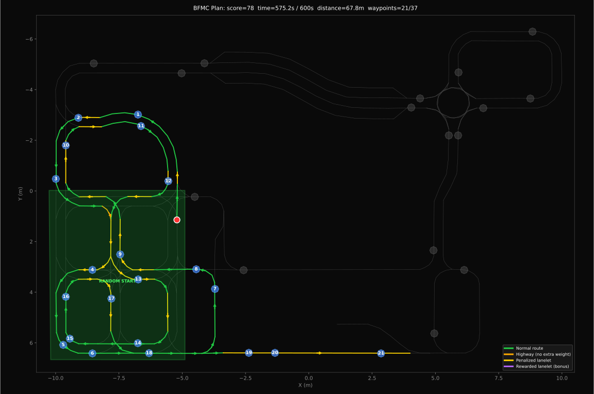
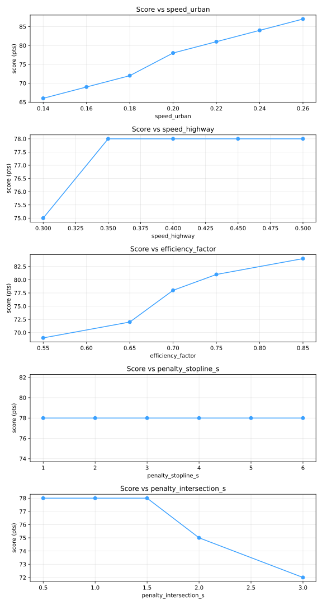
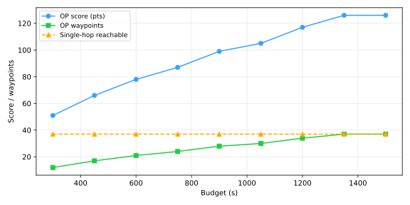

# BFMC Waypoint Route Planner

Planner offline para **Bosch Future Mobility Challenge 2026**. Dado el mapa Lanelet2 de la pista, calcula la ruta que **maximiza los puntos** (waypoints visitados + bonus por random start) dentro del presupuesto de tiempo de la prueba (10 min por defecto).

Modela la tarea como un **Orienteering Problem** sobre el grafo de lanelets, usando Dijkstra all-pairs como matriz de costos y un solver híbrido (greedy + 2-opt + Or-opt + Simulated Annealing). Genera un SVG anotado, un JSON con la secuencia de waypoints y lanelets, una animación GIF/MP4 del recorrido y reportes de sensibilidad / reachability.



> Visualización del plan `v2_tl`: 21/37 waypoints, 78 pts, 575s / 600s. Cada lanelet de la ruta tiene una flecha que indica el sentido real de tránsito; el punto rojo es la pose de inicio (dentro del polígono verde "RANDOM START").

---

## Tabla de contenidos

1. [Características clave](#características-clave)
2. [Instalación](#instalación)
3. [Quickstart](#quickstart)
4. [Estructura del proyecto](#estructura-del-proyecto)
5. [Modelo de costos](#modelo-de-costos)
6. [Modos de ejecución](#modos-de-ejecución)
   - [Modo random (default BFMC)](#1-modo-random-default-bfmc)
   - [Modo default (lanelet fijo)](#2-modo-default-lanelet-fijo)
   - [Modo max-waypoints (sin budget)](#3-modo-max-waypoints-sin-budget)
   - [Multi-start search](#4-multi-start-search)
7. [Flags del CLI](#flags-del-cli)
8. [Archivos de configuración](#archivos-de-configuración)
   - [Penalidades por lanelet](#penalidades-por-lanelet-datalanelet_penaltiesjson)
   - [Semáforos probabilísticos](#semáforos-probabilísticos-datatraffic_lightsjson)
   - [Constraints de orden](#constraints-de-orden-dataconstraintsjson)
   - [Topología de lanelets](#topología-de-lanelets)
9. [Outputs y gestión de planes](#outputs-y-gestión-de-planes)
10. [Visualización del plan](#visualización-del-plan)
11. [Herramientas auxiliares](#herramientas-auxiliares)
    - [Análisis de sensibilidad](#análisis-de-sensibilidad)
    - [Reachability vs budget](#reachability-vs-budget)
    - [Animación del recorrido](#animación-del-recorrido)
12. [Recetas comunes](#recetas-comunes)
13. [Tests](#tests)
14. [Internos / arquitectura](#internos--arquitectura)
15. [Troubleshooting](#troubleshooting)

---

## Características clave

- **Parser standalone** del OSM Lanelet2 (sin libs nativas, sin ROS, sin lanelet2).
- **Modelo de costos en segundos** con velocidad por tipo de lanelet, eficiencia, penalidades por atributo + por lanelet, y **modelo probabilístico de semáforos**.
- **Solver híbrido** Greedy + 2-opt + Or-opt + Simulated Annealing con random restarts.
- **Multi-start search**: probar N poses iniciales dentro del polígono random start y quedarse con la mejor.
- **Constraints de orden**: forzar primer waypoint, prohibidos, pares A-antes-que-B (regla BFMC).
- **Cache de cost matrix** invalidado por hash de OSM + params + topología.
- **Salidas anotadas**: SVG con flechas de sentido real, leyenda de penalidades, números de orden por waypoint, GIF/MP4 del recorrido.
- **Análisis de sensibilidad** y curva de **reachability** vs presupuesto.
- **46 tests** que cubren parser, topología, anclaje, cost matrix, solver, constraints, traffic lights, multi-start y E2E.

---

## Instalación

Requiere **Python 3.10+** (probado con 3.12). Recomendado usar un virtualenv del proyecto. En macOS / Linux con Python "externally-managed" es necesario.

```bash
git clone https://github.com/JoacoMarc/bfmc-waypoint-planner.git
cd bfmc-waypoint-planner
python3 -m venv .venv
source .venv/bin/activate
pip install -r requirements.txt
```

Dependencias: `numpy`, `matplotlib`, `pytest`, `pillow` (para GIF). Para MP4 hace falta `ffmpeg` en el `PATH`.

Activá el venv en cada terminal nueva del proyecto:

```bash
source .venv/bin/activate
```

---

## Quickstart

```bash
python3 tools/plan_bfmc_route.py \
  --osm data/lanelet2_map_FINAL_RandomStartingArea.osm \
  --name baseline \
  --start-mode random \
  --time-budget 600
```

Output esperado en consola:

```
[1/7] Parsing OSM ...                  nodes=2150  ways=415  lanelets=175  multipolygons=37
[2/7] Building lanelet topology        built 175 lanelets, 245 successor edges
[3/7] Extracting waypoints             37 waypoints + 1 start area
[4/7] Anchoring waypoints              37/37 anchored
[5/7] Computing cost matrix            cost matrix 38x38, cached
[6/7] Solving Orienteering Problem     score=78, cost=575.2s, restarts=30
[7/7] Writing JSON + SVG               data/outputs/plans/baseline/plan.{json,svg}

=== SUMMARY ===
Plan name:                baseline
Start mode:               random
Expected score:           78 pts
   - Random start bonus:  15 pts
   - Waypoints visited:   21/37 (63 pts)
Expected time:            575.20s / 600s
Expected distance:        67.79m
First waypoint:           1583
Start pose:               (-5.209, 1.145, -1.558 rad)
```

Outputs generados:

```
data/outputs/plans/baseline/
├── plan.json
├── plan.svg
└── metadata.json
```

Abrí el SVG en un navegador o IDE para ver la ruta. Para más calidad: subí `--restarts` y `--sa-iterations`.

---

## Estructura del proyecto

```
bfmc-waypoint-planner/
├── src/                          # Módulos del planner
│   ├── osm_parser.py             # Parser Lanelet2 OSM (sin libs nativas)
│   ├── geometry.py               # Polilíneas, anclajes, intersecciones
│   ├── topology.py               # Centerlines + sucesores + overrides
│   ├── waypoint_anchor.py        # Anclar waypoints (multipolygon) a lanelets
│   ├── cost_matrix.py            # Dijkstra all-pairs + cache + penalidades
│   ├── traffic_light.py          # Modelo probabilístico de semáforos
│   ├── constraints.py            # Restricciones de orden / forbidden
│   ├── orienteering_solver.py    # Greedy + 2-opt + Or-opt + SA
│   ├── multi_start.py            # Muestreo de poses iniciales
│   ├── reachability.py           # Curva score vs presupuesto
│   ├── sensitivity.py            # Sweeps de parámetros
│   ├── plan_writer.py            # Plan dataclass + JSON
│   ├── visualizer_svg.py         # Renderer SVG anotado
│   └── animate.py                # Animación GIF/MP4
├── tools/
│   ├── plan_bfmc_route.py        # CLI principal
│   ├── analyze_plan.py           # Sensibilidad + reachability
│   └── animate_plan.py           # GIF/MP4 desde plan guardado
├── tests/                        # Suite pytest (46 tests)
├── docs/assets/                  # Imágenes y animaciones (este README)
└── data/
    ├── lanelet2_map_FINAL_RandomStartingArea.osm
    ├── topology_current.json     # Sucesores ground-truth
    ├── topology_overrides.json   # Parches manuales (fallback)
    ├── lanelet_penalties.json    # Tiempo extra por lanelet
    ├── traffic_lights.json       # Modelo de semáforos
    ├── constraints.json          # Reglas de orden
    ├── cache/                    # Cache de cost matrix (gitignored)
    └── outputs/plans/<name>/     # Resultado de cada run
```

---

## Modelo de costos

El costo de recorrer un lanelet `L` se calcula como:

```
cost(L) = length(L) / (speed(L) × efficiency_factor)
        + penalty_attr(L)           # subtype del OSM: stopline / intersection / crosswalk / roundabout
        + penalty_lanelet(L)        # de lanelet_penalties.json (puede ser negativo)
        + E[wait_traffic_light(L)]  # si L está en traffic_lights.json, REEMPLAZA penalty_lanelet
```

donde:

- `speed(L)` es `--speed-urban` (0.2 m/s) o `--speed-highway` (0.4 m/s) según el tag del lanelet.
- `efficiency_factor` ∈ (0,1] descuenta tiempos de aceleración/frenado. Default 0.7.
- Penalidades por atributo (`subtype=stopline`, `subtype=intersection`, ...) se controlan con flags `--penalty-*`.
- Penalidades por lanelet vienen del JSON y se aplican a IDs específicos.
- Si un lanelet aparece en `traffic_lights.json`, su penalidad literal se **reemplaza** por la espera esperada del ciclo verde/amarillo/rojo (E[wait] ≈ 1.64s con cycle BFMC vs ~5s literal).

El costo total se clampa a `>= 0` para que los bonus negativos no rompan Dijkstra.

La cost matrix es de tamaño `(N+1) × (N+1)` donde N = cantidad de anchors de waypoints. La fila/columna 0 es el "virtual start" (la pose de inicio). Se construye con Dijkstra all-pairs y se cachea en `data/cache/` con hash sobre `(osm_mtime, params, topology, start_exit_lanelets)`.

**Score por defecto** (definido en `src/plan_writer.py`):

- `+10` por cada waypoint visitado.
- `+15` bonus si `--start-mode random` (el coche arranca dentro del random start area).
- En modo `default` no hay bonus.

---

## Modos de ejecución

### 1. Modo random (default BFMC)

```bash
python3 tools/plan_bfmc_route.py --osm ... --start-mode random
```

El coche puede arrancar en cualquier punto dentro del polígono "random start area" del OSM (way con tag `area=yes`, polygon 1821 en el mapa actual). El planner:

1. Detecta los lanelets que **salen** del polígono (entran inside, salen outside).
2. Elige el mejor par (pose inicial, lanelet de salida).
3. Suma el bonus `+15`.

La regla BFMC obliga a declarar el **primer waypoint válido**: configurálo con `must_visit_first` en `constraints.json`.

### 2. Modo default (lanelet fijo)

```bash
python3 tools/plan_bfmc_route.py --osm ... \
  --start-mode default --default-start-lanelet 995
```

El coche arranca al **inicio** del lanelet especificado (default `995`, que es la startline con semáforo). Sin bonus de start. Útil para:

- Debug reproducible (siempre arranca del mismo lado).
- Comparar planes con la misma pose inicial.

### 3. Modo max-waypoints (sin budget)

```bash
python3 tools/plan_bfmc_route.py --osm ... --max-waypoints
```

Ignora el presupuesto de tiempo y busca **conectar todos los waypoints alcanzables**, sin importar cuánto tarde. El plan resultante puede exceder `--time-budget` (que sólo se usa para reportar). Útil para:

- Ver cuál es el "techo" del mapa (37/37 si todos están conectados).
- Comparar contra el plan ajustado al budget.

### 4. Multi-start search

```bash
python3 tools/plan_bfmc_route.py --osm ... \
  --start-mode random --multi-start 20
```

En lugar de elegir UNA pose dentro del polígono random start, samplea N poses, ancla cada una al lanelet de salida más cercano con heading compatible, y resuelve el OP para cada una. Se queda con el mejor plan.

Costo: N×(restarts) iteraciones del solver. Con N=20, restarts=50 → ~30s. Recomendado para el plan oficial.

### Solver (`--solver`)

| Solver | Descripción |
|---|---|
| `greedy` | Construcción golosa (next waypoint con mejor ratio score/time). Rápido pero subóptimo. |
| `sa` | Simulated Annealing puro. Mejor para presupuestos ajustados. |
| `hybrid` (default) | Greedy → 2-opt → Or-opt → SA, con `--restarts` arranques independientes. Recomendado. |

---

## Flags del CLI

`tools/plan_bfmc_route.py`:

| Flag | Default | Descripción |
|---|---|---|
| `--osm PATH` | (requerido) | Archivo Lanelet2 OSM. |
| `--time-budget SEC` | `600` | Presupuesto total (ignorado por `--max-waypoints`). |
| `--speed-urban M/S` | `0.2` | Velocidad en lanelets urbanos. |
| `--speed-highway M/S` | `0.4` | Velocidad en lanelets highway (tag `subtype=highway`). |
| `--efficiency F` | `0.7` | Factor 0–1 de eficiencia (frenado/aceleración). |
| `--penalty-stopline SEC` | `4.0` | Tiempo extra al cruzar una stopline. |
| `--penalty-intersection SEC` | `1.5` | Tiempo extra en intersecciones. |
| `--penalty-crosswalk SEC` | `1.0` | Tiempo extra en crosswalks (atributo OSM). |
| `--penalty-roundabout SEC` | `1.0` | Tiempo extra en rotondas. |
| `--start-mode` | `random` | `random` o `default`. |
| `--default-start-lanelet ID` | `995` | Lanelet de arranque en modo `default`. |
| `--start-pose AUTO\|x,y,yaw` | `AUTO` | Pose inicial explícita (sobreescribe heurísticas). |
| `--multi-start N` | `1` | Samples de pose en random start area. |
| `--max-waypoints` | off | Ignora budget; maximiza waypoints visitados. |
| `--solver` | `hybrid` | `greedy` \| `sa` \| `hybrid`. |
| `--restarts N` | `30` | Reinicios del solver. |
| `--sa-iterations N` | `5000` | Iteraciones de SA por arranque. |
| `--seed N` | `42` | Seed RNG (reproducibilidad). |
| `--name STR` | timestamp | Subfolder en `data/outputs/plans/`. |
| `--plans-dir PATH` | `data/outputs/plans` | Carpeta padre. |
| `--output-json` / `--output-svg` | auto | Override de paths explícitos. |
| `--lanelet-penalties PATH` | `data/lanelet_penalties.json` | Penalidades por lanelet. |
| `--traffic-lights PATH` | `data/traffic_lights.json` | Modelo de semáforos. |
| `--constraints PATH` | `data/constraints.json` | Restricciones de orden. |
| `--topology-ground-truth PATH` | `data/topology_current.json` | Mapa de sucesores ground-truth. |
| `--topology-overrides PATH` | `data/topology_overrides.json` | Parches manuales (fallback si no hay ground-truth). |
| `--cache-dir PATH` | `data/cache` | Cache de cost matrix. |
| `--no-cache` | off | Desactiva el cache. |
| `--list-plans` | off | Lista los planes guardados y sale. |
| `--verbose` | off | Logs detallados del solver. |

---

## Archivos de configuración

### Penalidades por lanelet (`data/lanelet_penalties.json`)

Tiempo extra (segundos) por lanelet específico. **Se suma** al costo base. Valores negativos = bonus (incentiva al solver a usar ese lanelet).

```jsonc
{
  "_comment": "Penalidades por lanelet en segundos. Keys que empiezan con '_' son comentarios.",
  "_zone_J_parking": "Parking + crosswalk",
  "973": 31.0,

  "_startline": "Lanelet de arranque con semáforo",
  "995": 5.0,

  "_stop_signs": "STOP signs (3s por parar/arrancar)",
  "50":  3.0,
  "90":  3.0,
  "303": 3.0,
  "440": 3.0,
  "450": 3.0,
  "460": 3.0,
  "908": 3.0,
  "1004": 3.0,

  "_zone_G_traffic_lights": "Zone G: intersección con semáforos (E[wait] real ≈ 1.6s vía traffic_lights.json)",
  "740": 5.0, "745": 5.0, "748": 8.0, "828": 5.0, "835": 5.0,
  "838": 8.0, "855": 5.0, "858": 5.0, "1013": 5.0, "1030": 5.0,
  "1033": 5.0, "1043": 5.0, "1048": 5.0, "1060": 5.0, "1063": 5.0,
  "1080": 5.0, "1084": 5.0, "1086": 5.0, "1094": 5.0, "1097": 5.0,

  "_crosswalks": "Crosswalks específicos (slowdown ~1s)",
  "75":  1.0, "105": 4.0, "333": 1.0, "426": 1.0, "665": 1.0, "679": 1.0,

  "_highway_bonus": "Lanelets de highway: descuento para incentivar al solver",
  "221": -2.0, "245": -2.0, "285": -2.0, "481": -2.0, "502": -2.0,
  "506": -2.0, "508": -2.0, "509": -2.0, "511": -2.0, "521": -2.0,
  "523": -2.0, "524": -2.0, "526": -2.0, "530": -2.0,

  "_possible_obstacles": "Lanelets con probabilidad de peatones / obstáculos",
  "282": 2.0, "476": 2.0
}
```

Reglas:

- Lanelets que NO aparecen en el JSON: 0s extra.
- Lanelets que aparecen y también están en `traffic_lights.json`: el valor literal es **reemplazado** por E[wait] del ciclo (no se suma).
- El costo total se clampa a `>= 0` (un bonus muy grande no puede hacer negativo el costo de cruzar el lanelet).

### Semáforos probabilísticos (`data/traffic_lights.json`)

Para los lanelets listados, la cost matrix usa la **espera esperada** del ciclo (verde/amarillo/rojo) en vez de una penalidad fija.

```jsonc
{
  "_comment": "Modelo probabilístico de semáforos. E[wait] depende del ciclo.",
  "default_cycle": {"green_s": 5.0, "yellow_s": 3.0, "red_s": 3.0},
  "zones": {
    "G": {
      "_description": "Intersección con semáforos en zona G",
      "cycle": {"green_s": 5.0, "yellow_s": 3.0, "red_s": 3.0},
      "lanelets": ["740","745","748","828","835","838","855","858",
                   "1013","1030","1033","1043","1048","1060","1063",
                   "1080","1084","1086","1094","1097"]
    },
    "startline": {
      "_description": "Startline (lanelet 995) con semáforo",
      "cycle": {"green_s": 5.0, "yellow_s": 3.0, "red_s": 3.0},
      "lanelets": ["995"]
    }
  }
}
```

**Fórmula de espera esperada:**

```
E[wait] = P(yellow) × (yellow_s/2 + red_s) + P(red) × (red_s / 2)
```

Con ciclo BFMC (5/3/3, total 11s):

- P(green) = 5/11 → wait = 0
- P(yellow) = 3/11 → E[wait | yellow] = 1.5 + 3 = 4.5s
- P(red) = 3/11 → E[wait | red] = 1.5s
- **E[wait] = (3/11)·4.5 + (3/11)·1.5 = 18/11 ≈ 1.636 s**

Mucho menor que los 5s literales que el JSON antes usaba.

### Constraints de orden (`data/constraints.json`)

Restricciones duras que el solver respeta durante la construcción y mutación.

```jsonc
{
  "must_visit_first": "1424",            // primer waypoint obligatorio (regla BFMC random start)
  "must_visit":       ["1434", "1583"], // waypoints que TIENEN que estar
  "forbidden":        ["1772", "1762"], // waypoints prohibidos
  "before_after":     [["1424", "1434"]] // pares A-antes-que-B
}
```

Comportamiento:

- `must_visit_first`: el primer waypoint del plan (excluyendo el nodo virtual de start) DEBE ser este wp_id. Si no es alcanzable, el solver devuelve un plan inválido y se imprime warning.
- `must_visit`: validado post-hoc. Si falta alguno, el plan se reporta como inválido pero igual se guarda.
- `forbidden`: filtrado en cada decisión del solver. Esos waypoints nunca entran.
- `before_after`: `[A, B]` significa que si ambos se visitan, A va antes que B. Si solo se visita uno, no aplica.

Para deshabilitar todo: `{"must_visit_first": null, "must_visit": [], "forbidden": [], "before_after": []}`.

### Topología de lanelets

El parser infiere `successor_ids` por matching geométrico de bordes, pero el OSM a veces es ambiguo (intersecciones, lanelets paralelos, mismo nodo para entrada/salida). Dos mecanismos manuales (por orden de precedencia):

**1. Ground-truth (`data/topology_current.json`):** mapa completo `lanelet_id → [successor_ids]`. Si existe y está bien formado, **anula** todo lo inferido del OSM. Es la fuente de verdad recomendada.

```json
{
  "50":   ["55"],
  "55":   ["60"],
  "60":   ["65"],
  "888":  ["868"],
  "868":  ["872", "877"],
  "973":  ["50"],
  "995":  ["996"],
  "...": []
}
```

**2. Overrides (`data/topology_overrides.json`):** parches relativos a la inferencia. Sólo se usan si NO existe ground-truth.

```json
{
  "add_successors":    {"888": ["868"], "938": ["868"]},
  "remove_successors": {"888": ["872"]}
}
```

Para regenerar el ground-truth desde una topología existente:

```bash
python3 -c "
import sys, json
sys.path.insert(0, '.')
from src.osm_parser import parse_osm
from src.topology import build_lanelets, load_topology_ground_truth
doc = parse_osm('data/lanelet2_map_FINAL_RandomStartingArea.osm')
gt = load_topology_ground_truth('data/topology_current.json')
lanelets = build_lanelets(doc, step_m=0.05, ground_truth=gt)
topo = {lid: list(l.successor_ids) for lid, l in sorted(lanelets.items(), key=lambda kv: int(kv[0]))}
with open('data/topology_current.json', 'w') as f:
    json.dump(topo, f, indent=2)
print(f'Saved {len(topo)} lanelets, {sum(len(v) for v in topo.values())} successor edges')
"
```

---

## Outputs y gestión de planes

Cada run crea `data/outputs/plans/<name>/`:

| Archivo | Contenido |
|---|---|
| `plan.json` | Secuencia completa: waypoints (con order, anchor lanelet, entry/exit XY, score, cumulative time), lanelet sequence, pose de inicio, params usados, score esperado. |
| `plan.svg` | Visualización con pista, waypoints (azul=visitados, gris=skipped), ruta con flechas de sentido real, polígono random start (verde), pose inicial (punto rojo), leyenda de colores. |
| `metadata.json` | Resumen para `--list-plans`: name, created_at, mode, time_budget, score, time, waypoints. |
| `sensitivity.{md,svg}` | (si se corrió `analyze_plan.py --sensitivity`) Tabla y gráfico. |
| `reachability.{md,svg}` | (si se corrió `analyze_plan.py --reachability`) Curva budget vs score. |
| `animation.gif` o `animation.mp4` | (si se corrió `animate_plan.py`) Animación del recorrido. |

**Listar todos los planes guardados:**

```bash
python3 tools/plan_bfmc_route.py --list-plans
```

```
NAME                         CREATED              MODE           SCORE      TIME    WPS
----------------------------------------------------------------------------------------
baseline                     2026-05-17T11:42:01  budget          78    575.2s     21
v2_max_example               2026-05-17T11:55:13  max_waypoints  126   1254.1s     37
v2_constr                    2026-05-17T12:34:40  budget          75    580.6s     20
default_start_995            2026-05-17T03:20:39  budget          57    583.8s     19
```

---

## Visualización del plan

El SVG generado tiene varias capas:

- **Centerlines** del grafo completo en gris.
- **Lanelets de la ruta** con color según penalidad:
  - 🟢 Verde: lanelet normal urbano.
  - 🟠 Naranja: highway sin penalidad explícita.
  - 🟡 Amarillo: lanelet penalizado (positivo).
  - 🟣 Violeta: lanelet con bonus (negativo, highway premiado).
- **Flechas** en el midpoint de cada lanelet, orientadas según el **sentido real de tránsito en la ruta** (no según el orden de nodos del OSM).
- **Waypoints** como polígonos azul (visitados) o gris (descartados), con número de orden encima.
- **Random start area** en verde semi-transparente.
- **Pose inicial** como punto rojo (el sentido de la primera flecha indica el heading inicial).
- **Header** con score, tiempo, distancia, count de waypoints.
- **Leyenda** abajo a la derecha con los colores.


---

## Herramientas auxiliares

### Análisis de sensibilidad

Sobre un plan ya guardado, barre cada parámetro y mide cómo cambia el score:

```bash
python3 tools/analyze_plan.py --plan baseline --sensitivity \
  --restarts 20 --sa-iterations 2000
```

Output:

- `data/outputs/plans/baseline/sensitivity.md`: tabla markdown.
- `data/outputs/plans/baseline/sensitivity.svg`: gráfico de líneas.

Parámetros barridos:

- `speed_urban`: 0.14, 0.16, 0.18, 0.20, 0.22, 0.24, 0.26 m/s
- `speed_highway`: 0.30, 0.35, 0.40, 0.45, 0.50 m/s
- `efficiency_factor`: 0.55, 0.65, 0.70, 0.75, 0.85
- `penalty_stopline_s`: 1.0–6.0 s
- `penalty_intersection_s`: 0.5–3.0 s



> Score (pts) vs cada parámetro. Útil para entender qué tan robusto es el plan ante errores de estimación de velocidad o penalidades.

### Reachability vs budget

Para un mismo origen y costo matrix, ¿cómo cambia el score si tuviera más tiempo?

```bash
python3 tools/analyze_plan.py --plan baseline --reachability \
  --budget-range 300,1500,150 \
  --restarts 20 --sa-iterations 2000
```

`--budget-range start,end,step` define los puntos donde se evalúa.

Output:

- `data/outputs/plans/baseline/reachability.md`
- `data/outputs/plans/baseline/reachability.svg`: 3 series por budget:
  - **OP score (pts)**: lo que el solver alcanza.
  - **OP waypoints**: count efectivo de waypoints en el plan.
  - **Single-hop reachable**: cota superior (cuántos waypoints están a `<= budget` del start en línea directa).



> Curva de score, waypoints y reachable vs budget. Permite ver dónde la curva se aplana (no vale la pena más tiempo) y dónde sigue subiendo.

### Animación del recorrido

```bash
# GIF (default)
python3 tools/animate_plan.py --plan baseline

# GIF más rápido (4x velocidad real)
python3 tools/animate_plan.py --plan baseline --duration-scale 0.25 --fps 12

# MP4 (requiere ffmpeg)
python3 tools/animate_plan.py --plan baseline --mp4
```

Flags:

| Flag | Default | Descripción |
|---|---|---|
| `--plan NAME` | (requerido) | Nombre del plan guardado. |
| `--osm PATH` | `data/lanelet2_map_FINAL_RandomStartingArea.osm` | OSM (para rehidratar lanelets). |
| `--fps N` | `12` | Frames por segundo. |
| `--duration-scale F` | `0.25` | `plan_time × F` = duración del GIF. `1.0` = tiempo real. |
| `--mp4` | off | Output MP4 en vez de GIF. |
| `--output PATH` | auto | Path explícito. Default: dentro del folder del plan. |


> Animación del plan completo. El auto (rectángulo rojo) recorre la lanelet_sequence a la velocidad efectiva de cada lanelet. El título arriba muestra tiempo transcurrido, distancia y score.

---

## Recetas comunes

### Plan oficial BFMC (random start, 10 min, multi-start)

```bash
python3 tools/plan_bfmc_route.py \
  --osm data/lanelet2_map_FINAL_RandomStartingArea.osm \
  --name bfmc_final \
  --start-mode random --multi-start 8 \
  --time-budget 600 \
  --restarts 50 --sa-iterations 8000
```

### Ver el techo del mapa (todos los waypoints alcanzables)

```bash
python3 tools/plan_bfmc_route.py \
  --osm data/lanelet2_map_FINAL_RandomStartingArea.osm \
  --name max_all --max-waypoints \
  --restarts 30 --sa-iterations 5000
```

### Forzar primer waypoint y prohibir otros

Editá `data/constraints.json`:

```json
{
  "must_visit_first": "1583",
  "must_visit": [],
  "forbidden": ["1772", "1762"],
  "before_after": []
}
```

Y corré:

```bash
python3 tools/plan_bfmc_route.py --osm ... --name constrained
```

### Plan reproducible con pose manual

```bash
python3 tools/plan_bfmc_route.py \
  --osm data/lanelet2_map_FINAL_RandomStartingArea.osm \
  --name fixed_pose \
  --start-mode default \
  --default-start-lanelet 995 \
  --seed 42
```

Mismo seed + mismo OSM + mismas configs → mismo plan bit a bit.

### Comparar el plan ante velocidades distintas

```bash
# Pesimista
python3 tools/plan_bfmc_route.py --osm ... --name slow \
  --speed-urban 0.15 --speed-highway 0.30 --efficiency 0.6

# Optimista
python3 tools/plan_bfmc_route.py --osm ... --name fast \
  --speed-urban 0.25 --speed-highway 0.5 --efficiency 0.85

python3 tools/plan_bfmc_route.py --list-plans
```

### Suite full (plan + sensibilidad + reachability + animación)

```bash
NAME=full_run

python3 tools/plan_bfmc_route.py --osm data/lanelet2_map_FINAL_RandomStartingArea.osm \
  --name $NAME --multi-start 10 --restarts 50 --sa-iterations 8000

python3 tools/analyze_plan.py --plan $NAME --sensitivity --restarts 20 --sa-iterations 2000
python3 tools/analyze_plan.py --plan $NAME --reachability --budget-range 300,1500,150 \
  --restarts 20 --sa-iterations 2000
python3 tools/animate_plan.py --plan $NAME --fps 12 --duration-scale 0.25
```

---

## Tests

```bash
source .venv/bin/activate
pytest -q
```

Resultado esperado:

```
..............................................                           [100%]
46 passed in 0.85s
```

Cobertura:

- `test_osm_parser.py`: parsing del OSM, nodos, ways, relations, multipolygons.
- `test_geometry.py`: polilíneas, ray casting, intersecciones.
- `test_topology.py`: sucesores, overrides, ground-truth.
- `test_waypoint_anchor.py`: anclaje de waypoints a lanelets.
- `test_cost_matrix.py`: Dijkstra all-pairs, cache, penalidades.
- `test_traffic_light.py`: ciclo, E[wait], edge cases.
- `test_constraints.py`: filtrado de candidatos, validación de plan.
- `test_orienteering_solver.py`: greedy, 2-opt, SA, constraints.
- `test_multi_start.py`: sampling, anclaje a lanelets.
- `test_plan_end_to_end.py`: CLI completo + plan.json válido.

---

## Internos / arquitectura

```
┌────────────────────────────────────────────────────────────────┐
│  CLI: tools/plan_bfmc_route.py                                 │
└────────────────────────────────────────────────────────────────┘
         │
         ▼
┌────────────────────────────────────────────────────────────────┐
│ 1. parse_osm()                  src/osm_parser.py              │
│    OSM XML → nodes, ways, lanelets, multipolygons              │
└────────────────────────────────────────────────────────────────┘
         │
         ▼
┌────────────────────────────────────────────────────────────────┐
│ 2. build_lanelets()             src/topology.py                │
│    + load_topology_ground_truth | overrides                    │
│    → Lanelet dataclass con centerline + successors             │
└────────────────────────────────────────────────────────────────┘
         │
         ▼
┌────────────────────────────────────────────────────────────────┐
│ 3. extract_waypoint_areas() +   src/waypoint_anchor.py         │
│    compute_waypoint_anchors()                                  │
│    → list[WaypointAnchor]: cada waypoint con su lanelet entry  │
└────────────────────────────────────────────────────────────────┘
         │
         ▼
┌────────────────────────────────────────────────────────────────┐
│ 4. find_start_exit_lanelets() o default lanelet                │
│    → start_exit_lanelets: candidatos para arrancar             │
└────────────────────────────────────────────────────────────────┘
         │
         ▼ (con --multi-start N)
┌────────────────────────────────────────────────────────────────┐
│ 5. run_multi_start()            src/multi_start.py             │
│    Loop sobre N samples de pose: para cada uno, 6+7.           │
│    Mejor plan gana.                                            │
└────────────────────────────────────────────────────────────────┘
         │
         ▼
┌────────────────────────────────────────────────────────────────┐
│ 6. build_cost_matrix()          src/cost_matrix.py             │
│    Dijkstra all-pairs sobre el grafo de lanelets               │
│    Costo = length/(speed·eff) + attr_penalty + lanelet_penalty │
│         + E[wait_TL]                                           │
│    Cache hash(osm,params,topology,start_exit) en data/cache/   │
└────────────────────────────────────────────────────────────────┘
         │
         ▼
┌────────────────────────────────────────────────────────────────┐
│ 7. solve_orienteering()         src/orienteering_solver.py     │
│    Greedy NN → 2-opt → Or-opt → SA, restarts independientes    │
│    Constraints aplicados en cada decisión.                     │
└────────────────────────────────────────────────────────────────┘
         │
         ▼
┌────────────────────────────────────────────────────────────────┐
│ 8. build_plan() + write_plan_json() + render_plan_svg()        │
│    src/plan_writer.py, src/visualizer_svg.py                   │
│    → data/outputs/plans/<name>/                                │
└────────────────────────────────────────────────────────────────┘
```

**Pipeline de costos en detalle:**

Para ir del waypoint i al j, la cost matrix calcula:

```
D[i, j] = (length(L_i) - exit_arc_i) / v_eff(L_i)
        + sum(total_cost(L_k) for L_k in dijkstra_path(L_i.end → L_j.start))
        + entry_arc_j / v_eff(L_j)
```

donde el "exit_arc_i" es el punto sobre la centerline de `L_i` donde el waypoint se considera "consumido", y `entry_arc_j` es el punto donde se "entra" al waypoint j. Esto evita doble-contar el tramo intra-lanelet entre waypoints que comparten lanelet.

**Cache de cost matrix:**

```python
hash(
  osm_mtime,
  CostParams.to_dict(),          # incluye penalties + TL model
  topology.to_summary_dict(),
  start_exit_lanelets             # como tuple ordenado
)
```

Si cualquier input cambia, el hash cambia y la matriz se reconstruye. Si no, se carga desde `data/cache/`.

---

## Troubleshooting

**El plan visita pocos waypoints aunque hay tiempo:** subí `--restarts` y `--sa-iterations`. Si seguís cerca del techo, probá `--multi-start 10` o más.

**El primer waypoint cambia cada vez:** estás usando random pose sin seed fijo. Usá `--seed N` para reproducibilidad. Para forzar el primer waypoint usa `must_visit_first` en `constraints.json`.

**Una flecha del SVG apunta al revés:** la dirección de cada lanelet se infiere del orden en `lanelet_sequence` y la geometría con el lanelet siguiente. Si seguís viendo errores, revisá que `topology_current.json` tenga los sucesores correctos para ese lanelet.

**Los waypoints no se anclan a ningún lanelet:** la centerline del lanelet no pasa por el polígono del waypoint. Verificá el OSM (que el waypoint esté geométricamente bien) o ajustá `max_distance_m` en `src/waypoint_anchor.py`.

**El cache no se invalida:** `--no-cache` fuerza recomputar. O borrá `data/cache/*.npz`. El cache se invalida automáticamente si cambia el OSM, params, topología o penalty files.

**`ModuleNotFoundError: matplotlib`:** estás usando un Python sin las dependencias instaladas. Activá el venv: `source .venv/bin/activate`.

**`ffmpeg not found` al generar MP4:** instalá ffmpeg (`brew install ffmpeg` en macOS) o usá GIF.

**Plan vacío en `--max-waypoints`:** algún waypoint no tiene anchor o el grafo de lanelets está desconectado. Revisá `topology_current.json` y los warnings en el output del CLI.
